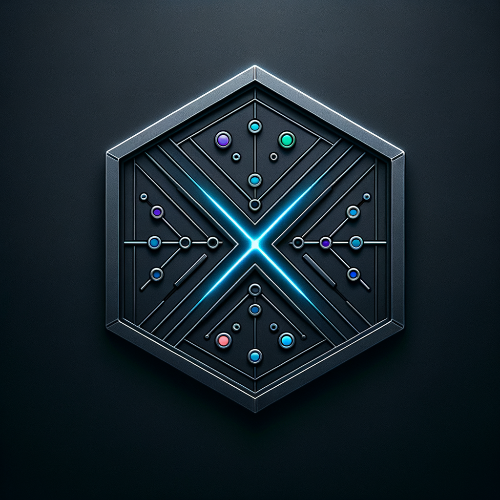
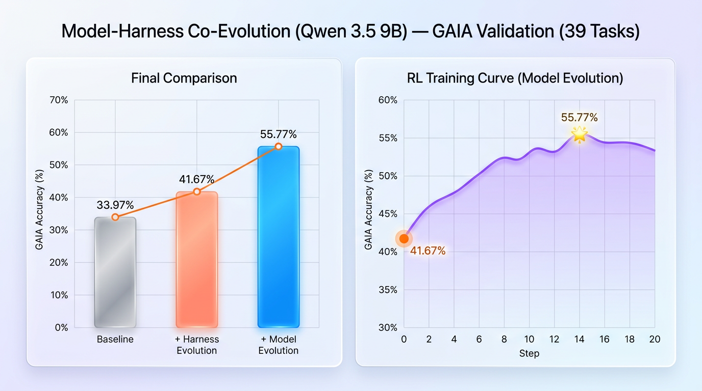

<table align="center" border="0" cellspacing="0" cellpadding="0"><tr><td align="center" valign="middle">

</td><td align="left" valign="middle">
<picture>
  <source media="(prefers-color-scheme: dark)" srcset="docs/assets/harnessx_wordmark_dark.png"/>
  <source media="(prefers-color-scheme: light)" srcset="docs/assets/harnessx_wordmark.png"/>
  
</picture>
<br/>
<b>组合。&nbsp; 适配。&nbsp; 进化。</b>
</td></tr></table>

<p align="center">
  <strong>组合 Harness，定义 Agent。<br/>
  从零代码到完全自定义 —— 一个核心，X 个入口。</strong>
</p>

<p align="center">
  <a href="LICENSE"></a>
  
  
  
  <a href="https://darwin-agent.github.io/HarnessX/"></a>
</p>

<p align="center">
  <a href="https://darwin-agent.github.io/HarnessX/">项目主页</a> •
  <a href="#overview">概述</a> •
  <a href="#architecture">架构</a> •
  <a href="#quick-start">快速开始</a> •
  <a href="#benchmarks">基准测试</a> •
  <a href="#roadmap">路线图</a>
</p>

---

<a id="overview"></a>
## 🔭 概述


> **决定 Agent 性能的是 Harness，而不仅仅是模型。** 相同的基础模型，因上下文管理方式、工具编排方式、错误恢复方式以及评估信号反馈方式的不同，会产生截然不同的结果。

HarnessX 是一个 **Harness 铸造厂**：从可复用的处理器和 Bundle 中锻造任意数量的 Agent Harness，为每个 Harness 配对任意模型，并通过训练不断进化 —— 全程无需重写 Agent。

大多数框架解决了模型切换的问题，而**行为切换**的成本依然高昂 —— 从编码 Agent 切换到研究 Agent、添加记忆或安全护栏，都意味着重写 Agent。

HarnessX 通过一个清晰的分离解决了这个问题：

```python
agent = model.agentic(harness)
```

- `ModelConfig` —— 提供商路由、降级回退、按角色分配模型
- `HarnessConfig` —— 完整的行为流水线（工具、记忆、处理器、追踪、沙箱）

Harness**X** 中的 **X** 代表可e**X**tensible（可扩展）行为组合 —— 无需重写 Agent 即可组合、适配和进化 Harness：

🧩 **组合** —— 9 维行为流水线；任何行为 = 处理器，用 `|` 运算符自由组合。

⚙️ **适配** —— Harness 观察性能并自动搜索最优的 Harness 配置。

🚀 **进化** —— 每次运行都产生带奖励标注的轨迹，用于 SFT / RL 训练。

---

<a id="architecture"></a>
## 🏗️ 架构

<p align="center">
  
</p>

→ 完整的 9 维行为流水线、处理器钩子点及组合 API，详见 **[docs/architecture.md](docs/architecture.md)**。

---

<a id="quick-start"></a>

## 🚀 快速开始

<details>
<summary>点击展开</summary>

### 安装

**一键安装**（交互式 —— 安装前会询问是否安装 uv、Node.js 及可选的 IM Gateway）：

```bash
curl -sSf https://raw.githubusercontent.com/Darwin-Agent/HarnessX/main/scripts/install.sh | bash
```

**非交互式 —— 无需确认，安装全部组件：**

```bash
curl -sSf https://raw.githubusercontent.com/Darwin-Agent/HarnessX/main/scripts/install.sh | bash -s -- --all
```

两种方式均会安装 uv、Python 3.12、harnessx，以及（在 Node.js 可用时）Harness Lab 前端。
安装完成后，重新加载 Shell 或执行 `source ~/.bashrc`（macOS 上为 `~/.zshrc`）。

<details>
<summary>使用 <a href="https://docs.astral.sh/uv/">uv</a> 手动安装</summary>

```bash
uv python install 3.12
uv venv --python 3.12 .venv
source .venv/bin/activate
uv pip install -e .
# 构建前端（hx lab 需要）
cd frontend && npm install && npm run build && cd ..
```

</details>

### CLI

```bash
export ANTHROPIC_API_KEY=sk-...

hx "研究 2026 年 AI Agent 趋势并撰写结构化报告"
hx -p "用 Python 写一个 fizzbuzz"     # 非交互模式，输出后退出
hx -c path/to/config.yaml             # 加载 YAML 配置
hx --resume <run_id>                  # 恢复上次会话
hx lab                                # 在 localhost:8000 打开 Lab UI
```

### IM Gateway

通过单一服务将 Agent 连接到飞书、Telegram、Slack、Discord 或钉钉。
Gateway 内置了用于管理频道、会话和工作区的 React 控制台。

```bash
hx-gateway start   # 启动 Gateway（配置文件：~/.harnessx/gateway.yaml）
```

→ 设置、频道配置及架构说明，详见 **[gateway/README.md](gateway/README.md)**。

### Python SDK

<details>
<summary>最小可运行示例</summary>

```python
import asyncio
from harnessx import BaseTask, HarnessConfig
from harnessx.core.model_config import ModelConfig
from harnessx.providers.anthropic_provider import AnthropicProvider

async def main():
    model = ModelConfig(main=AnthropicProvider("claude-sonnet-4-6"))
    harness = model.agentic(HarnessConfig())
    result = await harness.run(BaseTask(description="What is 2 + 2?"))
    print(result.final_output)

asyncio.run(main())
```

</details>

</details>

---

<a id="benchmarks"></a>
## 📊 基准测试

HarnessX 提供两个进化循环，可在任意基准测试上系统性地提升 Agent 性能：

- **Harness 进化** —— 元 Harness 分析轨迹，自动搜索更优的处理器组合、提示策略和工具配置，*无需更换模型*。
- **模型进化** —— Harness 运行产生的带奖励标注轨迹通过 [VERL](https://github.com/volcengine/verl) 驱动 RL 微调，持续改进模型本身。

两个循环可组合使用：先进化 Harness，再在此基础上进化模型。以下是在 [GAIA](https://huggingface.co/datasets/gaia-benchmark/GAIA) 基准测试上的结果。更多基准测试及适配器详情，见 [`benchmarks/README.md`](benchmarks/README.md)。

### Harness 进化（Qwen 3.5 9B）

从默认 Harness（R0，33%）出发，元 Harness 逐轮发现更优配置 —— R3 达到 **47%**，**零模型改动下提升 +14pp**。→ 复现：[`recipe/gaia_evolver/`](recipe/gaia_evolver/)

<p align="center">
  
</p>

### Harness 进化（GPT-5）

同样的方法可扩展至前沿模型。经进化后，GAIA 整体准确率从 62% 提升至 **84%**，五个领域全面提升。→ 复现：[`recipe/gaia_evolver/`](recipe/gaia_evolver/)

<p align="center">
  
</p>

### 模型-Harness 协同进化（Qwen 3.5 9B）

两个循环协同运行时，收益叠加：Harness 进化将基线从 33.97% 提升至 41.67%；模型进化进一步推至 **55.77%** —— **相对提升 +64%**，全程基于 9B 模型。→ 复现：[`recipe/verl_harnessX/`](recipe/verl_harnessX/)

<p align="center">
  
</p>

---

<a id="structure"></a>
## 📁 项目结构

```
HarnessX/
├── harnessx/                  # 🧠 核心框架
│   ├── core/                  #    Harness、Builder、RunLoop、State、Events、Trajectory
│   ├── processors/            #    7 大类 × 多个处理器
│   │   ├── context/           #    📝 系统提示、历史、用户包装
│   │   ├── control/           #    🛡️ 13 个安全与可靠性处理器
│   │   ├── evaluation/        #    📊 LLM 裁判、PRM、自验证
│   │   ├── memory/            #    🧠 提取、检索、5 种策略
│   │   ├── multi_model/       #    🔗 模型路由
│   │   ├── observability/     #    🔭 OTel、检查点、指标
│   │   └── tools/             #    🔧 技能加载器、schema 适配器、过滤器
│   ├── providers/             # 🔌 6 个模型后端 + agentic mixin
│   ├── plugins/               # 🧩 插件基类、发现机制、内置插件、维度
│   │   └── dimensions/
│   │       └── light_memory/  # 🧠 Light-Memory（自研）
│   ├── tools/                 # ⚒️ 工具注册表、内置工具
│   ├── sandbox/               # 📦 本地、Docker、E2B
│   ├── tracing/               # 📡 日志、OTel、空追踪器
│   ├── rl/                    # 🧬 RLConfigSpec、TaskBuilder
│   ├── bundles/               # 📦 预组合能力 Bundle
│   ├── api/                   # 🌐 FastAPI + SSE（供 Lab UI 使用）
│   └── cli.py                 # ⌨️ CLI 入口（hx）
├── benchmarks/                # 📊 4 个已集成 + 3 个进行中的基准测试
├── recipe/                    # 🧪 slime（RL 训练配方）
├── examples/                  # 📖 编码 / 研究 / 助手 / 自定义处理器
├── extensions/                # 🔌 技能扩展（docx、pdf、pptx、xlsx）
├── frontend/                  # 🖥️ Lab UI（React + TypeScript + Tailwind）
└── tests/                     # ✅ 单元测试、集成测试、E2E 测试
```

---

<a id="roadmap"></a>
## 🗺️ 路线图

> 规划项目的详细设计说明和动机，见 [ROADMAP](docs/ROADMAP.md)。

| 阶段 | 重点 | 状态 |
|:----:|------|:----:|
| **1** | 核心：9 维行为流水线、13 个处理器、多提供商支持、SFT/RL 桥接、4 个基准测试、Lab UI |  |
| **2** | 元优化：贝叶斯优化、元 Harness、自动配置搜索 |  |
| **3** | 自进化：闭环训练、HarnessHUB 社区市场 |  |
| **4** | 记忆：多模态后端、第三方集成（VERL、SuperMemory、OpenVKing） |  |

### 仓库内实现

- [x] **[Light-Memory](docs/feats/light-memory.md)** —— 基于文件的记忆，支持时间衰减、每日压缩、git 版本控制（`harnessx/plugins/dimensions/light_memory/`）
- [x] **Slime RL 配方** —— SGLang rollout 适配器 + token 标注 + GRPO 训练流水线（`recipe/slime/`）
- [x] **MetaHarness** —— Agent 观察自身轨迹并提出 Harness 配置变更；观察者 Harness + 元 Agent + 沙箱提升循环
- [ ] **LoCoMo 基准测试** —— 长上下文记忆评估：会话召回、跨轮一致性、压缩保真度
- [ ] **贝叶斯优化** —— 在约 10^6 配置的 Harness 空间上进行代理模型搜索
- [ ] **HarnessHUB** —— 社区平台，用于发布、版本管理和拉取 `HarnessConfig` Bundle（`hx pull coding-agent@v1.2`；Lab UI 面板；私有注册表）
- [ ] **多模态记忆** —— 通过插件系统实现基于 CLIP 的图像/视频记忆后端
- [ ] **Harness 记忆进化** —— 闭环：轨迹 → RL 微调 → 更优模型 → 更优 Harness；种群级变异 + 数据飞轮

### 第三方集成 *（可选接入，位于 `recipe/`）*

- [x] **[VERL](https://github.com/volcengine/verl)** —— 将 HarnessX rollout 接入分布式 PPO / GRPO 训练循环
- [ ] **[MemPalace](https://github.com/mem-palace/mem-palace)** —— 结构化情节记忆后端
- [ ] **[SuperMemory](https://supermemory.ai)** —— 通过插件系统实现云端语义记忆
- [ ] **[OpenVKing](https://github.com/openvking)** —— 面向实体丰富领域的向量知识图谱记忆
- [ ] **记忆质量指标** —— 通过 HarnessJournal 暴露检索精度/召回率
- [ ] **数据合成流水线** —— 带多样性约束的受控 SFT / 偏好数据集生成

---

## 🤝 贡献

HarnessX 基于 MIT 许可证**完全开源**。欢迎贡献以下内容：

- 🧩 **新处理器** —— 探索未覆盖维度的行为模块
- 🧠 **新记忆后端** —— 通过插件系统接入
- 📊 **新基准测试适配器** —— 参照 `benchmarks/` 目录模式
- 🧪 **RL 训练配方** —— 放置于 `recipe/`
- 🖥️ **Lab UI 改进**

请先阅读 [CONTRIBUTING.md](CONTRIBUTING.md)。

---

```bibtex
@software{harnessx2026,
  title   = {HarnessX: A Composable, Self-Evolving Agent Harness Foundry},
  author  = {Darwin Agent Team},
  year    = {2026},
  url     = {https://github.com/Darwin-Agent/HarnessX},
  license = {MIT},
}
```

---

<div align="center">
  <strong>HARNESS</strong><strong>X</strong> — <em>组合。适配。进化。</em>
  <br/>
  <sub>由 <strong>Darwin Agent 团队</strong> 精心打造</sub>
</div>
