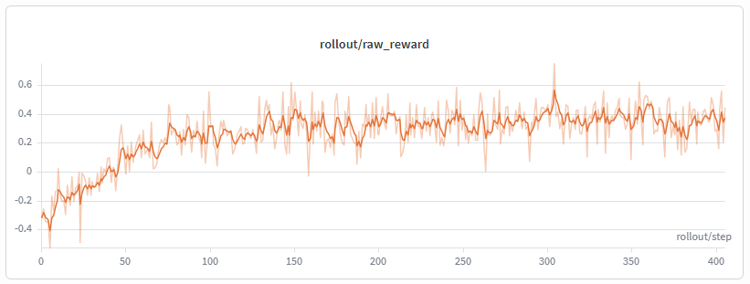
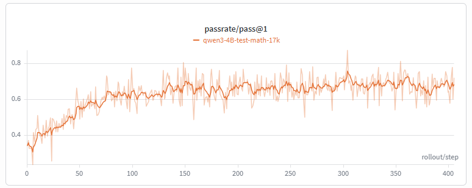

# Slime + HarnessX Integration

HarnessX + Slime RL training integration. Implements Slime's custom `generate()` / `reward_func()` interfaces using HarnessX's agent framework for multi-turn tool-augmented RL training.

## Architecture

```
Slime train_async.py
  |
  |-- generate(args, sample, sampling_params)     # custom generate hook
  |-- reward_func(args, sample)                   # custom reward hook
  |
  v
recipe/slime/harness_rollout.py                   # adapter (zero task logic)
  |
  |-- registry.py: load_harness_config(sample)    # task_type -> SlimeConfigSpec
  |-- harness.py:  make_slime_harness(spec, ...)  # -> HarnessConfig
  |
  v
HarnessX Harness.run()
  |-- SystemPromptProcessor     # set system prompt
  |-- TokenBudgetProcessor      # hard context-window safety guard
  |-- RLControlPlugin           # RL signal collection + episode metrics
  |-- EvaluationProcessor       # terminal evaluation
  |-- SGLangProvider.complete() # token-level /generate with logprob capture
  |
  v
SGLang /generate endpoint
```

### Key Design Decisions

1. **Zero task logic in the adapter**: `harness_rollout.py` has no domain knowledge. All task-specific behavior (tools, evaluator, reward shaping, system prompt) is declared in `registry.py` via `SlimeConfigSpec`.

2. **Registry pattern**: Adding a new task type requires only adding an entry to `HARNESS_CONFIGS` in `registry.py`. No changes to `harness_rollout.py` or HarnessX core.

3. **Retool format compatibility**: The `formatter.py` module provides Jinja2-based tokenization that matches the SFT checkpoint's exact training format, avoiding BPE boundary mismatches during incremental tokenization.

## Components

| Component | File | Role |
|-----------|------|------|
| Config spec | `spec.py` | `SlimeConfigSpec` dataclass extending `RLConfigSpec` |
| Task registry | `registry.py` | `HARNESS_CONFIGS` dict + `load_harness_config()` |
| Rollout adapter | `harness_rollout.py` | `generate()` + `reward_func()` for Slime |
| Harness factory | `harness.py` | `make_slime_harness()` -> `HarnessConfig` |
| RL format | `formats/slime_format.py` | `SlimeRLFormat` -> Slime GRPO episode record |
| Preflight | `preflight.py` | Pre-training sanity checks |

### Math Task (`recipe/slime/math/`)

| Component | File | Role |
|-----------|------|------|
| Task builder | `builder.py` | `MathTaskBuilder` (dapo-math-17k + AIME formats) |
| Evaluator | `evaluator.py` | `MathBoxedEvaluator` (\\boxed{} extraction) |
| Rewards | `rewards.py` | `RetoolCompatPRM` + `math_format_reward` |
| Tools | `tools.py` | `code_interpreter_tool` (Python sandbox) |
| Formatter | `formatter.py` | Retool Jinja2 tokenization formatters |
| Data prep | `data_prep.py` | Dataset download + preprocessing |

## Data Flow

```
Sample.prompt ──> MathTaskBuilder.build() ──> RLTask(description, label)
                                                    |
    SlimeConfigSpec (tools, evaluator, prm, system_prompt)
                |                                   |
                v                                   v
    SGLangProvider(formatter, tokenizer)    HarnessConfig(processors)
                |                                   |
                +---------> Harness.run(task) <-----+
                                |
                    [multi-turn tool-calling loop]
                                |
                                v
                 StatefulTrajectory + EvalResult
                                |
                +---------------+---------------+
                |                               |
                v                               v
     traj.to_rl_records(SlimeRLFormat)   reward_func(sample)
                |                               |
                v                               v
     sample.tokens/loss_mask/logprobs    {"score": float, ...}
```

## Showcase: Math RL Training (Qwen3-4B)

### Pipeline

1. **Data preparation**: `python -m recipe.slime.math.data_prep --all`
   - Downloads dapo-math-17k (RL train), ReTool-SFT (SFT train), aime-2024 (eval) to `data/slime/retool/`

2. **SFT training**: `bash recipe/slime/launch/run_math_sft.sh`
   - Fine-tunes Qwen3-4B-Instruct on ReTool-SFT dataset
   - 3 epochs, cosine LR schedule (1e-5 -> 1e-6)

3. **RL training**: `bash recipe/slime/launch/run_math_rl.sh`
   - GRPO on dapo-math-17k with code_interpreter tool
   - 8 samples per prompt, KL loss (k3, coef=0.01)

### Results on AIME 2024

| Stage | AIME 2024 pass@1 |
|-------|-----------------|
| SFT (baseline) | 17.50% |
| RL (400 steps) | **21.15%** |

### Training Curves

**Reward curve** — rollout/raw_reward over training steps:



**Pass rate** — pass@1 on test-math-17k over training steps:



## Adding a New Task

1. Create `recipe/slime/<task>/` with: `builder.py`, `evaluator.py`, `rewards.py`, `tools.py`
2. Import the components in `registry.py`
3. Add a `SlimeConfigSpec` entry to `HARNESS_CONFIGS`
4. No changes to `harness_rollout.py` or HarnessX core needed

```python
# registry.py
from recipe.slime.code.builder import CodeTaskBuilder
from recipe.slime.code.evaluator import UnitTestEvaluator
from recipe.slime.code.tools import bash_tool

HARNESS_CONFIGS["code"] = SlimeConfigSpec(
    task_builder  = CodeTaskBuilder(),
    tools         = [bash_tool],
    evaluator_cls = UnitTestEvaluator,
    prm           = NullPRM(),
    system_prompt = "You are a coding assistant...",
    max_steps     = 32,
    task_type     = "code",
)
```

## Quick Start

```bash
# 1. Preflight checks
python -m recipe.slime.preflight

# 2. Prepare datasets
python -m recipe.slime.math.data_prep --all

# 3. SFT training
bash recipe/slime/launch/run_math_sft.sh

# 4. RL training
bash recipe/slime/launch/run_math_rl.sh
```

Environment variables:
- `WANDB_KEY`: Weights & Biases API key
- `NUM_GPUS` / `ACTOR_GPUS` / `ROLLOUT_GPUS`: GPU allocation (default: 8/4/4)
- `HARNESSX_SAMPLE_TIMEOUT`: Per-sample timeout in seconds (default: 360 for RL)
- `HARNESSX_VALIDATE_TOKENS=1`: Enable token annotation consistency checks (dev only)
